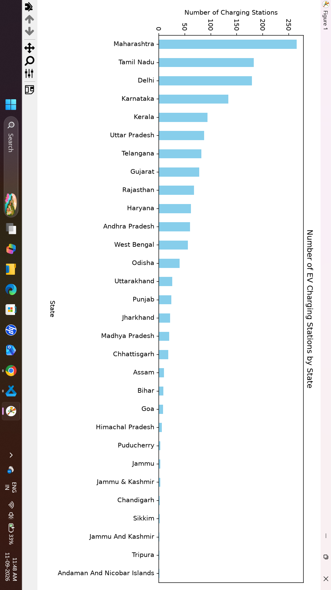
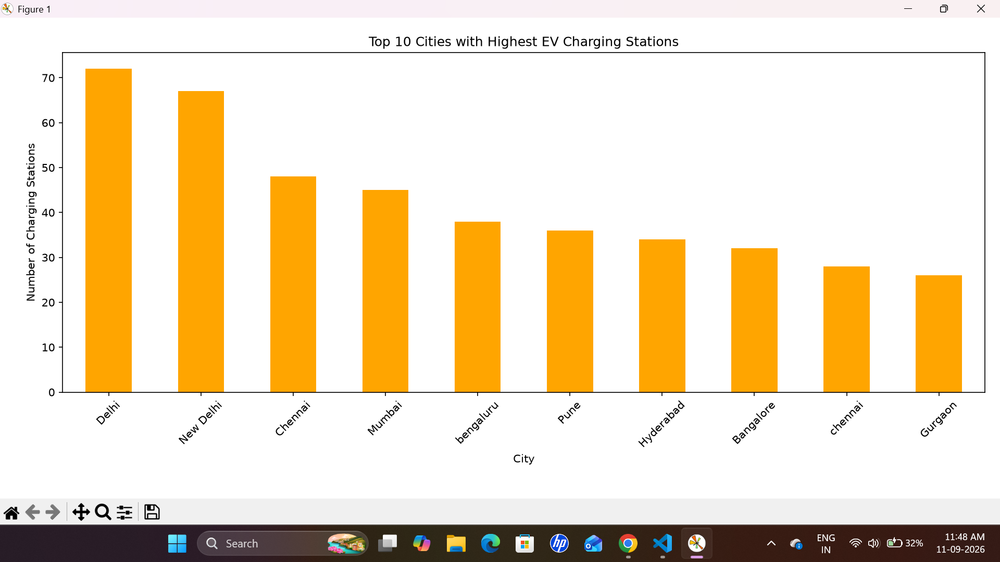
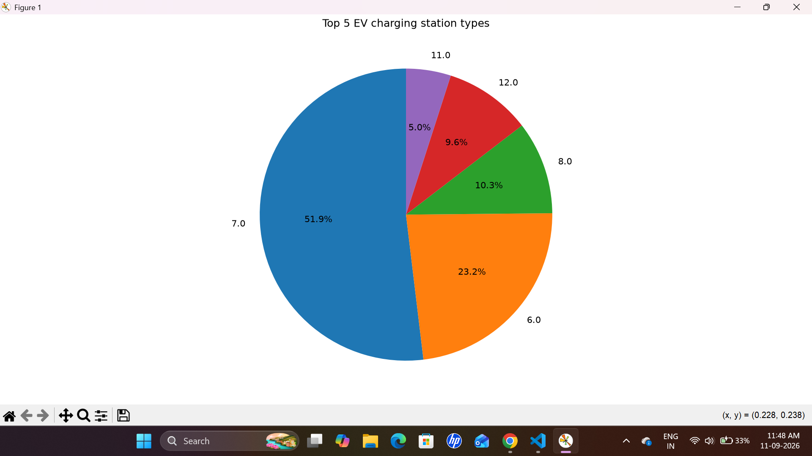
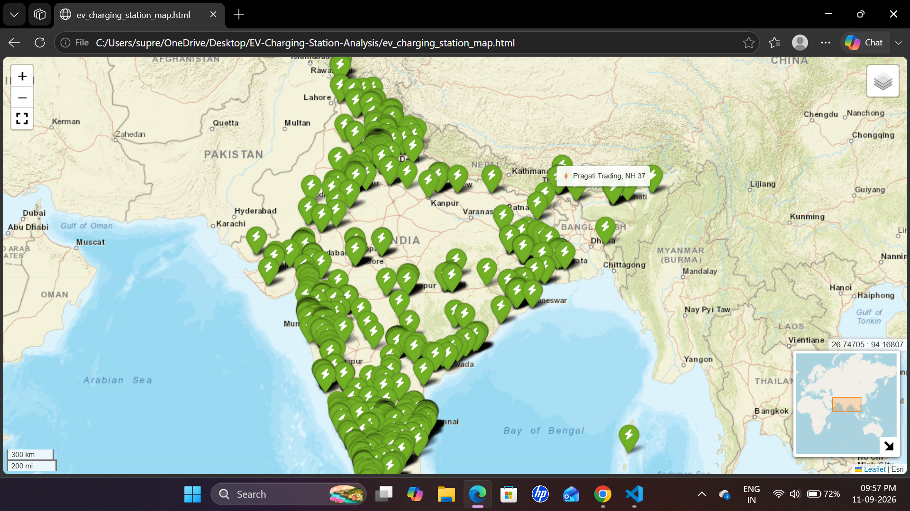

# EV Charging Station Analysis in India

A beginner-friendly data analysis project that explores the distribution of EV charging stations across India using Python and data analysis libraries.

## Project Overview

This project analyzes an EV charging station dataset to understand the distribution of charging stations across different states and cities in India.

The project includes data understanding, numerical analysis, data analysis using Pandas, data visualization, and an interactive geographical map using Folium.

## Dataset

- Total Records: 1,547
- Total Columns: 7
- Dataset: EV Charging Stations in India

### Main Features

- Station Name
- State
- City
- Address
- Latitude
- Longitude
- Charging Type

## Technologies Used

- Python
- Pandas
- NumPy
- Matplotlib
- Folium

## Project Structure

```text
EV-Charging-Station-Analysis/
│
├── Data/
│   └── ev-charging-stations-india.csv
│
├── Python/
│   ├── data_understanding.py
│   ├── numpy_analysis.py
│   ├── pandas_analysis.py
│   └── visualization.py
│
├── outputs/
│   ├── analysis_report.pdf
│   ├── ev_charging_station_map.html
│   ├── interactive_map.png
│   └── charts/
│       ├── state_chart.png
│       ├── city_chart.png
│       └── charging_type_chart.png
│
└── README.md

## Analysis Performed

### 1. Data Understanding

The dataset was explored to understand:

- Dataset shape and structure
- Column information
- Missing values
- Duplicate records
- Basic statistical information

### 2. NumPy Analysis

NumPy was used for numerical analysis of the geographical coordinates.

The analysis includes:

- Mean latitude and longitude
- Median latitude and longitude
- Standard deviation
- Minimum and maximum latitude

### 3. Pandas Analysis

Pandas was used to analyze the distribution of EV charging stations.

The analysis includes:

- State-wise charging station counts
- Top cities with the highest number of stations
- Charging station type distribution
- Number of unique states, cities, and charging types

## Data Visualization

The project includes visualizations to understand important patterns in the dataset.

### EV Charging Stations by State

Shows the distribution of EV charging stations across different states in India.



### Top 10 Cities

Shows the cities with the highest number of EV charging stations.



### Top 5 Charging Station Types

Shows the five most frequently recorded charging station types in the dataset.




## Interactive EV Charging Station Map

An interactive map was created using Folium to visualize the geographical distribution of EV charging stations across India.

The map includes:

- Interactive EV charging station markers
- Station details through popups
- Station name tooltips
- Fullscreen mode
- Mini map
- Mouse position showing latitude and longitude
- Esri World Street Map as the base map

[View Interactive EV Charging Station Map](outputs/ev_charging_station_map.html)




## Key Insights

- Maharashtra has the highest number of EV charging stations in the dataset.
- Major cities have a higher concentration of charging stations.
- Delhi is among the cities with the highest number of charging stations.
- The dataset contains 29 unique states, 362 unique cities, and 18 charging types.
- The geographical map shows the overall spread of EV charging infrastructure across India.


## Project Report

A detailed project report containing the complete analysis, visualizations, and results is available below.

[View Project Report](outputs/analysis_report.pdf)


## Conclusion

This project provides a clear overview of EV charging infrastructure in India using data analysis and visualization techniques.

It demonstrates how Python, Pandas, NumPy, Matplotlib, and Folium can be used to explore real-world data, identify useful patterns, and visualize geographical distribution.

The analysis helps understand the distribution of charging stations across states and cities and provides insights into the current EV charging infrastructure dataset.